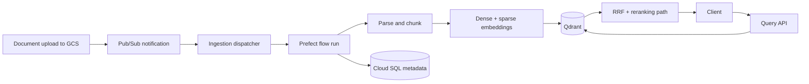

# Turbo-RAG

Turbo-RAG is a production-shaped retrieval-augmented generation platform on GCP. The goal is to show the platform engineering around RAG: infrastructure, identity, ingestion, retrieval, orchestration, observability, and deployment lifecycle.

This is not a notebook-only RAG demo. The repository is organized as deployable services and infrastructure so the same patterns can move from a dev environment toward a production environment with minimal redesign.

**Roadmap:** [`docs/project-roadmap.md`](docs/project-roadmap.md) · **Step plans:** [`docs/plan/`](docs/plan/README.md) · **Current status:** [`docs/STATUS.md`](docs/STATUS.md) · **Dev rebuild runbook:** [`quick-dev-reset.md`](quick-dev-reset.md)

## Current State

Last updated: **2026-06-01**. The dev platform has completed the foundation and ingestion phases. Query and retrieval are in progress: the query API and hybrid dense+sparse retrieval with Reciprocal Rank Fusion are implemented, and the next step is a CrossEncoder reranker.

Implemented now:

- GCP infrastructure with Terraform: VPC, GKE with private nodes, Artifact Registry, Cloud SQL, Secret Manager, Pub/Sub, IAM, and Workload Identity.
- Kubernetes deployments with Helm for `api`, `ingestion`, `query`, `workers`, and Qdrant.
- Document ingestion from GCS through Pub/Sub and Prefect into PostgreSQL metadata and Qdrant vectors.
- Chunking strategies, Vertex AI dense embeddings, FastEmbed/Qdrant BM25 sparse embeddings, MLflow experiment logging, idempotency, and DLQ replay support.
- Query service with `POST /query`, Qdrant hybrid retrieval, app-side RRF, readiness checks, and per-step retrieval latency logs.

Planned next:

- CrossEncoder reranking, API auth/RBAC, SSE streaming, OpenTelemetry traces, Langfuse, Prometheus/Grafana, CI/CD, canary deployment, load testing, and disaster recovery drills.

## Technology Stack

| Area | Technologies |
| ---- | ------------ |
| Cloud | GCP, GKE Standard, Cloud SQL for PostgreSQL, Cloud Storage, Pub/Sub, Artifact Registry, Secret Manager, Vertex AI |
| Infrastructure | Terraform, Helm, Kubernetes, Workload Identity, private networking, Cloud NAT, Private Service Access |
| Services | Python, FastAPI, Uvicorn, Pydantic |
| Retrieval | Qdrant, Vertex `text-embedding-004`, FastEmbed `Qdrant/bm25`, Reciprocal Rank Fusion |
| Ingestion and workflows | Prefect, GCS notifications, Pub/Sub dispatcher, async workers |
| Experimentation and observability | MLflow implemented for chunking experiments; Langfuse, OpenTelemetry, Prometheus, and Grafana planned |
| Delivery | Docker images in Artifact Registry; GitHub Actions with OIDC/WIF planned |

## Platform Flow



## Key Design Decisions

| Decision | Current choice | Why |
| -------- | -------------- | --- |
| GCP-first platform | GKE, Cloud SQL, Pub/Sub, Secret Manager, Vertex AI | Keeps infrastructure, identity, and model access inside one cloud boundary. |
| Infrastructure as code | Terraform modules per platform concern | Makes dev rebuilds repeatable and keeps the path to prod explicit. |
| Kubernetes delivery | Helm charts per service and Qdrant | Gives each service a clear deployable unit without hiding Kubernetes details. |
| Service identity | Workload Identity instead of service account JSON keys | Avoids long-lived cloud credentials in pods, images, or the repository. |
| Vector store | Qdrant on GKE as a StatefulSet | Keeps vector search in the platform while preserving operational ownership. |
| Hybrid retrieval | Qdrant dense + sparse vectors with app-side RRF | Avoids introducing a second retrieval store before the platform needs one. |
| Ingestion orchestration | Pub/Sub dispatcher creates Prefect runs and acks only after success | Keeps upload events durable and makes retry/DLQ behavior explicit. |
| Document identity | `bucket/object#generation` | Handles overwrite/reupload cases without ambiguous document IDs. |
| Experiments | MLflow for chunking experiments before changing production defaults | Lets retrieval behavior improve through measured changes rather than ad hoc tuning. |

## Repository Layout

```text
Turbo-RAG/
├── infra/                  # Terraform root and modules
├── helm/                   # Helm charts for services and Qdrant
├── services/
│   ├── api/                # API service skeleton
│   ├── ingestion/          # Pub/Sub dispatcher service
│   ├── query/              # Query API and retrieval code
│   ├── workers/            # Prefect flows, parsing, chunking, Qdrant writes
│   └── shared/             # Shared contracts, sparse encoder, RRF helpers
├── scripts/                # Operational helper scripts
├── docs/
│   ├── plan/               # Acceptance criteria per roadmap step
│   ├── history/            # Implementation history and working commands
│   ├── STATUS.md           # Current agent task board
│   └── project-roadmap.md  # Phase roadmap
├── quick-dev-reset.md      # Rebuild/runbook after cost-control teardown
└── README.md
```

## Documentation Map

- [`docs/project-roadmap.md`](docs/project-roadmap.md) explains the full phase plan and target architecture.
- [`docs/plan/`](docs/plan/README.md) contains acceptance criteria for each implementation step.
- [`docs/STATUS.md`](docs/STATUS.md) tracks what is done, what is in progress, and blockers.
- [`docs/history/`](docs/history/) records meaningful implementation steps, decisions, and commands that worked.
- [`quick-dev-reset.md`](quick-dev-reset.md) is the operational runbook for restoring the current dev platform after cost-control teardown.

## Progress Details

### Phase Summary

| Phase | Focus | Status |
| ----- | ----- | ------ |
| 1 | Foundation — Infra as Code | **Done** (dev) |
| 2 | Ingestion pipeline | **Done** (dev) |
| 3 | Query & retrieval service | **In progress** |
| 4 | Observability stack | Planned |
| 5 | CI/CD + MLflow registry | Planned |
| 6 | Scaling & hardening | Planned |

### Phase 1 — Foundation

| Step | Task | Status | Plan |
| ---- | ---- | ------ | ---- |
| 1.1 | GCP project bootstrap | **Done** | [1.1](docs/plan/phase-1-foundation/1.1-gcp-bootstrap.md) |
| 1.2 | Terraform project structure | **Done** | [1.2](docs/plan/phase-1-foundation/1.2-terraform-layout.md) |
| 1.2b | Network: VPC, PSA, NAT | **Done** | [1.2b](docs/plan/phase-1-foundation/1.2b-network-foundation.md) |
| 1.3 | GKE cluster | **Done** | [1.3](docs/plan/phase-1-foundation/1.3-gke-cluster.md) |
| 1.4 | Artifact Registry | **Done** | [1.4](docs/plan/phase-1-foundation/1.4-artifact-registry.md) |
| 1.5 | Cloud SQL for PostgreSQL | **Done** | [1.5](docs/plan/phase-1-foundation/1.5-cloudsql.md) |
| 1.6 | Secret Manager | **Done** | [1.6](docs/plan/phase-1-foundation/1.6-secret-manager.md) |
| 1.7 | Dockerized service skeletons | **Done** | [1.7](docs/plan/phase-1-foundation/1.7-service-skeletons.md) |
| 1.8 | Helm charts | **Done** | [1.8](docs/plan/phase-1-foundation/1.8-helm-charts.md) |
| 1.9 | Qdrant on GKE | **Done** | [1.9](docs/plan/phase-1-foundation/1.9-qdrant.md) |
| 1.10 | Workload Identity bindings | **Done** | [1.10](docs/plan/phase-1-foundation/1.10-workload-identity.md) |

### Phase 2 — Ingestion

| Step | Task | Status | Plan |
| ---- | ---- | ------ | ---- |
| 2.1 | GCS bucket + Pub/Sub | **Done** | [2.1](docs/plan/phase-2-ingestion/2.1-gcs-pubsub.md) |
| 2.2 | Prefect on GKE | **Done** | [2.2](docs/plan/phase-2-ingestion/2.2-prefect-on-gke.md) |
| 2.3 | Ingestion flow | **Done** | [2.3](docs/plan/phase-2-ingestion/2.3-ingestion-flow.md) |
| 2.4 | Chunking + MLflow | **Done** | [2.4](docs/plan/phase-2-ingestion/2.4-chunking-mlflow.md) |
| 2.5 | DLQ + idempotency | **Done** | [2.5](docs/plan/phase-2-ingestion/2.5-dlq-idempotency.md) |

### Phase 3 — Query & Retrieval

| Step | Task | Status | Plan |
| ---- | ---- | ------ | ---- |
| 3.1 | Query API skeleton | **Done** | [3.1](docs/plan/phase-3-query-retrieval/3.1-query-api-skeleton.md) |
| 3.2 | Hybrid search + RRF | **Done** | [3.2](docs/plan/phase-3-query-retrieval/3.2-hybrid-search-rrf.md) |
| 3.3 | CrossEncoder reranker | **Next** | [3.3](docs/plan/phase-3-query-retrieval/3.3-reranker.md) |
| 3.4 | Auth + RBAC | Planned | [3.4](docs/plan/phase-3-query-retrieval/3.4-auth-rbac.md) |
| 3.5 | SSE streaming | Planned | [3.5](docs/plan/phase-3-query-retrieval/3.5-sse-streaming.md) |
| 3.6 | OpenTelemetry traces | Planned | [3.6](docs/plan/phase-3-query-retrieval/3.6-otel-traces.md) |

### Later Phases

| Phase | Focus | Plan |
| ----- | ----- | ---- |
| 4 | Langfuse, Prometheus, Grafana, metrics, dashboards, OTel Collector | [Phase 4](docs/plan/phase-4-observability/README.md) |
| 5 | GitHub Actions, OIDC/WIF, MLflow server, registry, canary rollback | [Phase 5](docs/plan/phase-5-cicd-mlflow/README.md) |
| 6 | HPA, load testing, backups/restore drills, ADRs | [Phase 6](docs/plan/phase-6-scaling-hardening/README.md) |

## Suggested Next Step

Implement **3.3 CrossEncoder reranker** so hybrid retrieval candidates can be reranked before answer generation.
