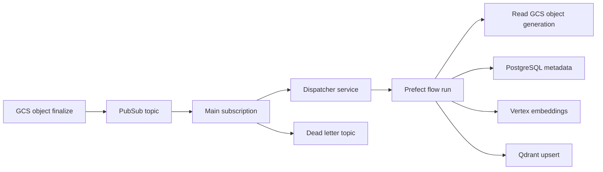

# Phase 2 — Ingestion pipeline

**Goal:** Upload a document → automatic parse, chunk, embed, upsert to Qdrant, metadata in PostgreSQL.

**Blocked until:** Phase 1 complete (GKE, Qdrant, WI, skeleton services deployed).

**Suggested order:** 2.1 → 2.2 → 2.3 → 2.4 → 2.5 (DLQ topology in 2.5; idempotency keys seeded in 2.3).

## Architecture decisions

These choices are hard to change later; implement them explicitly in 2.1–2.5.

| Decision | Choice | Rationale |
| -------- | ------ | --------- |
| Trigger model | **Dedicated dispatcher service** in `platform` namespace | Pulls Pub/Sub, starts Prefect flow runs, acks only after success. Clear ack/retry semantics; avoids Prefect polling or push-endpoint auth complexity in Phase 2. |
| Document version identity | **GCS `bucket + object name + generation`** | Aligns with GCS notifications; supports overwrites, replay, and stale chunk cleanup per version. |
| Orchestration | **Prefect 2.x** on GKE | Server on `system` pool; flow jobs on Spot `worker` pool. |
| Metadata store | **PostgreSQL `rag_metadata`** (Cloud SQL, IAM auth) | Source of truth for document lifecycle; Qdrant is a derived index. |
| Vector store | **Qdrant** (cluster-internal HTTP) | Point IDs derived from document version + chunk index. |
| Embeddings | **Vertex `text-embedding-004`** (`us-central1`) | Batched calls; model name from config only. |



## Phase 2 invariants

All steps must preserve these rules:

1. **No JSON keys** — GCP access via Workload Identity only ([1.10](../phase-1-foundation/1.10-workload-identity.md)).
2. **No early Pub/Sub ack** — the dispatcher acks a message only after the Prefect flow run completes successfully. Never use `--auto-ack` on the production subscription during validation.
3. **Deterministic document version identity** — `document_version_id = f"{bucket}/{object_name}#{generation}"`; chunk and Qdrant point IDs derive from this, not from run time or random UUIDs.
4. **PostgreSQL is source of truth** — document status, version, and chunk records live in `rag_metadata`; Qdrant payloads must include fields needed for Phase 3 retrieval and stale filtering.
5. **Transactional metadata writes** — upsert document version + chunks in a single DB transaction where possible; Qdrant upsert after metadata commit (or compensating delete on Qdrant failure documented in flow).
6. **Stale chunk cleanup** — when a new generation supersedes a logical document, mark old version inactive and delete or filter its Qdrant points.
7. **Bounded concurrency** — batch Vertex embeddings and Qdrant upserts; cap parallel flow runs per dispatcher config.
8. **Secrets via CSI** — OpenAI key (dev tests only) from `/var/secrets/openai-api-key`, not env vars in manifests ([1.6](../phase-1-foundation/1.6-secret-manager.md)).

## Data contracts (conceptual)

Implement in [2.3](2.3-ingestion-flow.md); validate in [2.5](2.5-dlq-idempotency.md).

| Entity | Key fields | Unique constraints |
| ------ | ---------- | ------------------ |
| `documents` | `logical_uri` (`bucket/object_name`), `latest_version_id`, `status` | `logical_uri` |
| `document_versions` | `document_version_id`, `bucket`, `object_name`, `generation`, `content_hash`, `status` | `(bucket, object_name, generation)` |
| `chunks` | `chunk_id`, `document_version_id`, `chunk_index`, `text_hash`, `qdrant_point_id` | `(document_version_id, chunk_index)` |
| `ingestion_runs` | `run_id`, `document_version_id`, `prefect_flow_run_id`, `status`, `started_at`, `finished_at` | `prefect_flow_run_id` |

**Qdrant point ID:** `uuid5(NAMESPACE_DOCUMENT, f"{bucket}/{object_name}#{generation}:{chunk_index}")`

**Qdrant payload (minimum):** `logical_uri`, `document_version_id`, `chunk_index`, `generation`, `content_hash`, `source_uri`

## Service identities

| Component | K8s namespace | KSA | GCP SA | Primary roles |
| --------- | ------------- | --- | ------ | ------------- |
| Dispatcher | `platform` | `ingestion` | `ingestion-sa-{env}` | `storage.objectViewer`, `pubsub.subscriber` on main sub |
| Prefect server | `prefect` | `prefect-server` | `prefect-server-sa-{env}` | `cloudsql.client`; IAM DB user on `prefect` DB |
| Prefect flow jobs | `prefect` (or `platform`) | `workers` | `workers-sa-{env}` | `storage.objectViewer`, `pubsub.subscriber`, `aiplatform.user`, `cloudsql.client`; IAM DB user on `rag_metadata` |

Details: [2.1](2.1-gcs-pubsub.md) (IAM), [2.2](2.2-prefect-on-gke.md) (Prefect + Cloud SQL auth).

## Before you start

Complete this checklist **once per project** before the first `terraform apply` in Phase 2. Phase 1 hit the same class of failures when APIs or local tools were missing ([`docs/FAILURES.md`](../../FAILURES.md), [`docs/history/lessons.md`](../../history/lessons.md)).

### APIs (enable before targeted apply)

```bash
gcloud services enable pubsub.googleapis.com aiplatform.googleapis.com \
  --project=turbo-rag
gcloud services list --enabled --project=turbo-rag | grep -E 'pubsub|aiplatform'
```

If apply fails with `API has not been used in project ... or it is disabled`, enable the API and re-run apply (same pattern as PSA / `servicenetworking.googleapis.com` in Phase 1).

### Local tools

| Tool | Used in |
| ---- | ------- |
| `gcloud` | APIs, uploads, Pub/Sub pull, credentials |
| `terraform` | `infra/modules/pubsub`, IAM extension, Cloud SQL DB |
| `kubectl` | Pod proofs, Prefect, flows |
| `gke-gcloud-auth-plugin` | GKE auth (required for `kubectl`) |
| `helm` | Prefect install — or kubectl-only fallback per [`docs/history/secret_manager.md`](../../history/secret_manager.md) |

### GKE reminders (worker pool)

- Regional cluster: `min_node_count` / `max_node_count` on node pools are **per zone** ([`docs/history/lessons.md`](../../history/lessons.md)).
- Prefect flow jobs target the **Spot `worker` pool** — ensure the pool has at least one Ready node before flow validation.
- Any new PVC mounts: set storage paths explicitly (Qdrant snapshot lesson in `lessons.md`).

### Phase 1 lessons to avoid repeating

| Lesson | Phase 2 mitigation |
| ------ | ------------------- |
| API disabled before apply | Prep checklist above |
| `kubectl` / gke auth plugin missing | Tool table above |
| WI roles deferred from 1.10 | Explicit scope in [2.1](2.1-gcs-pubsub.md) + [2.2](2.2-prefect-on-gke.md) |
| Helm missing | Prefect [2.2](2.2-prefect-on-gke.md) documents kubectl fallback |
| Unsafe Pub/Sub validation | Use peek-only or test subscription — see [2.1](2.1-gcs-pubsub.md) |

## Steps

| Step | Doc | Focus |
| ---- | --- | ----- |
| 2.1 | [2.1-gcs-pubsub.md](2.1-gcs-pubsub.md) | GCS + Pub/Sub + dispatcher IAM |
| 2.2 | [2.2-prefect-on-gke.md](2.2-prefect-on-gke.md) | Prefect on GKE + identities + `prefect` DB |
| 2.3 | [2.3-ingestion-flow.md](2.3-ingestion-flow.md) | E2E flow + data contracts + performance |
| 2.4 | [2.4-chunking-mlflow.md](2.4-chunking-mlflow.md) | Chunking experiments + durable MLflow |
| 2.5 | [2.5-dlq-idempotency.md](2.5-dlq-idempotency.md) | DLQ + idempotency + stale cleanup validation |

**Phase done when:** All acceptance criteria in 2.1–2.5 pass in **dev**.
