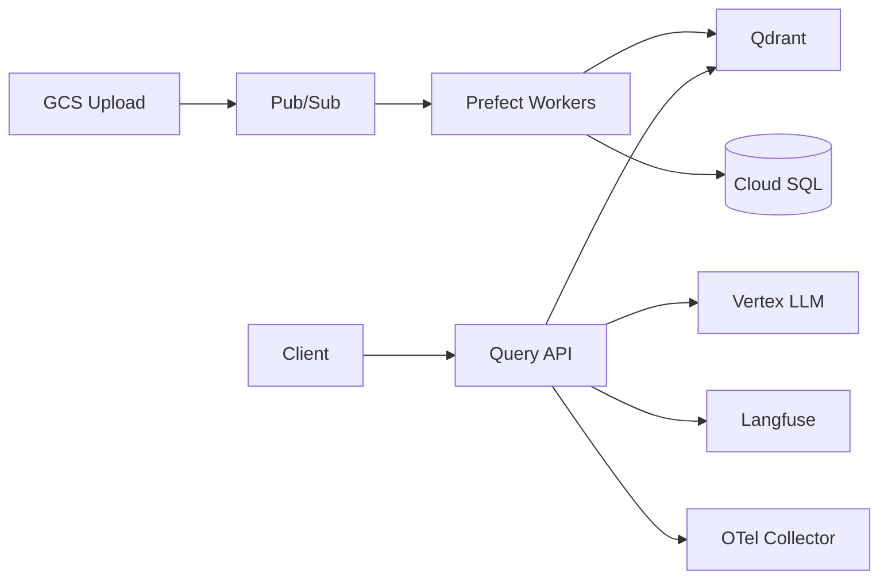

# RAG ML Platform on GCP — Project Roadmap

> **Purpose:** Production-grade, MLOps-focused RAG on GCP. Focus is **platform engineering** (scalability, observability, deployment lifecycle)—not RAG accuracy tuning.
>
> **Stack:** FastAPI · Qdrant · Prefect · Langfuse · Prometheus · Grafana · OpenTelemetry · MLflow · GKE · Terraform · Helm · GitHub Actions

**Detailed steps:** Each sub-step has acceptance criteria in [`docs/plan/`](plan/README.md). Track day-to-day progress in [`docs/STATUS.md`](STATUS.md).

---

## Phase overview

| # | Phase | Focus | Plan folder | Est. |
| - | ----- | ----- | ----------- | ---- |
| 1 | Foundation — Infra as Code | GCP, network, GKE, data plane, skeleton deploy | [phase-1-foundation/](plan/phase-1-foundation/) | ~1.5 wk |
| 2 | Ingestion pipeline | GCS → Pub/Sub → Prefect → Qdrant | [phase-2-ingestion/](plan/phase-2-ingestion/) | ~2 wk |
| 3 | Query & retrieval | Hybrid search, rerank, auth, SSE | [phase-3-query-retrieval/](plan/phase-3-query-retrieval/) | ~2 wk |
| 4 | Observability | Langfuse, Prometheus, Grafana, OTel | [phase-4-observability/](plan/phase-4-observability/) | ~2 wk |
| 5 | CI/CD + MLflow | GitHub Actions (OIDC), registry, canary | [phase-5-cicd-mlflow/](plan/phase-5-cicd-mlflow/) | ~1.5 wk |
| 6 | Scaling & hardening | HPA, load test, DR, ADRs | [phase-6-scaling-hardening/](plan/phase-6-scaling-hardening/) | ~2 wk |

---

## Phase 1 — Foundation (summary)

**Goal:** Reproducible GCP + GKE; **skeleton** services only (`/health`, `/ready`, optional stub `/metrics`)—no RAG logic.

| Step | Topic | Plan |
| ---- | ----- | ---- |
| 1.1 | GCP bootstrap (APIs, state bucket, bootstrap SA → OIDC later) | [1.1](plan/phase-1-foundation/1.1-gcp-bootstrap.md) |
| 1.2 | Terraform layout + remote state | [1.2](plan/phase-1-foundation/1.2-terraform-layout.md) |
| 1.2b | **VPC, PSA, NAT** (prod-shaped networking) | [1.2b](plan/phase-1-foundation/1.2b-network-foundation.md) |
| 1.3 | GKE Standard + 3 pools + Workload Identity | [1.3](plan/phase-1-foundation/1.3-gke-cluster.md) |
| 1.4 | Artifact Registry | [1.4](plan/phase-1-foundation/1.4-artifact-registry.md) |
| 1.5 | Cloud SQL (private IP, IAM auth, backups) | [1.5](plan/phase-1-foundation/1.5-cloudsql.md) |
| 1.6 | Secret Manager + CSI | [1.6](plan/phase-1-foundation/1.6-secret-manager.md) |
| 1.7 | Docker skeletons | [1.7](plan/phase-1-foundation/1.7-service-skeletons.md) |
| 1.8 | Helm charts | [1.8](plan/phase-1-foundation/1.8-helm-charts.md) |
| 1.9 | Qdrant StatefulSet | [1.9](plan/phase-1-foundation/1.9-qdrant.md) |
| 1.10 | Workload Identity bindings | [1.10](plan/phase-1-foundation/1.10-workload-identity.md) |

**Suggested order:** 1.1 → 1.2 → **1.2b** → 1.3 → 1.4 → 1.5–1.6 → 1.7–1.9 → 1.10.

**Early quality gates (before Phase 4):** `terraform validate`, `helm lint`, image build, health probes, structured logs.

---

## Phases 2–6 (summary)

### Phase 2 — Ingestion

Upload → parse → chunk → embed (Vertex `text-embedding-004`) → Qdrant + PostgreSQL. Includes DLQ and idempotent flows.

Steps: [2.1](plan/phase-2-ingestion/2.1-gcs-pubsub.md) · [2.2](plan/phase-2-ingestion/2.2-prefect-on-gke.md) · [2.3](plan/phase-2-ingestion/2.3-ingestion-flow.md) · [2.4](plan/phase-2-ingestion/2.4-chunking-mlflow.md) · [2.5](plan/phase-2-ingestion/2.5-dlq-idempotency.md)

### Phase 3 — Query & retrieval

Hybrid search (dense + BM25 + RRF), CrossEncoder rerank, JWT/RBAC, SSE streaming, OTel traces on the query path.

Steps: [3.1](plan/phase-3-query-retrieval/3.1-query-api-skeleton.md) – [3.6](plan/phase-3-query-retrieval/3.6-otel-traces.md)

### Phase 4 — Observability

Langfuse for LLM traces; Prometheus/Grafana for SLOs; full `/metrics`; alerting; OTel Collector DaemonSet.

Steps: [4.1](plan/phase-4-observability/4.1-langfuse.md) – [4.5](plan/phase-4-observability/4.5-otel-collector.md)

### Phase 5 — CI/CD + MLflow

GitHub Actions with **OIDC/WIF** (no long-lived keys); MLflow on GCS + Cloud SQL; model registry; canary + RAGAS rollback.

Steps: [5.1](plan/phase-5-cicd-mlflow/5.1-github-actions.md) – [5.4](plan/phase-5-cicd-mlflow/5.4-canary-rollback.md)

### Phase 6 — Scaling & hardening

HPA, Locust load tests, **restore drills** (Cloud SQL PITR + Qdrant snapshots to GCS), ADRs.

Steps: [6.1](plan/phase-6-scaling-hardening/6.1-hpa-autoscaling.md) – [6.4](plan/phase-6-scaling-hardening/6.4-adrs.md)

---

## Platform flow (target)



---

## Repository structure

```
Turbo-RAG/
├── infra/                  # Terraform
├── services/               # api, ingestion, query, workers
├── helm/                   # One chart per service + qdrant
├── .github/workflows/
├── docs/
│   ├── plan/               # Per-step acceptance criteria
│   ├── adr/
│   ├── STATUS.md
│   └── history/
└── README.md
```

---

## Key design decisions

| Decision | Choice | Rejected | Reason |
| -------- | ------ | -------- | ------ |
| Vector DB | Qdrant on GKE (StatefulSet) | Pinecone | Infra ownership; persistence story |
| Orchestration | Prefect 2.x | Airflow | Python-native; K8s jobs |
| LLM tracing | Langfuse self-hosted | LangSmith | Data stays in GCP |
| Auth to GCP | Workload Identity | SA JSON keys | No keys in pods |
| CI auth | GitHub OIDC → WIF | Long-lived JSON | Least privilege, rotation |
| Messaging | Pub/Sub | Kafka | Managed, lower ops |
| Embeddings | Vertex text-embedding-004 | OpenAI ada | GCP-native + WI |

Full ADRs: Phase [6.4](plan/phase-6-scaling-hardening/6.4-adrs.md).

---

## Environments & state

| Concern | Dev | Prod |
| ------- | --- | ---- |
| GCP project | `turbo-rag` (current) | Separate project recommended |
| Terraform tfvars | `infra/environments/dev.tfvars` | `prod.tfvars` |
| State prefix | `terraform/state` (migrate to `/dev`, `/prod`) | Separate prefix before prod apply |
| Apply | Local or CI plan/apply | CI only with approval |

---

## Security principles (all phases)

1. **No** service account JSON keys in git, images, or Kubernetes Secrets for GCP access.
2. Bootstrap SA is temporary; migrate Terraform CI to **OIDC** in Phase 5.
3. Cloud SQL: private IP + IAM auth; backups on from provisioning ([1.5](plan/phase-1-foundation/1.5-cloudsql.md)).
4. Third-party API keys: Secret Manager + CSI mount ([1.6](plan/phase-1-foundation/1.6-secret-manager.md)).
5. Network: VPC + PSA + NAT before treating dev as prod-shaped ([1.2b](plan/phase-1-foundation/1.2b-network-foundation.md)).
